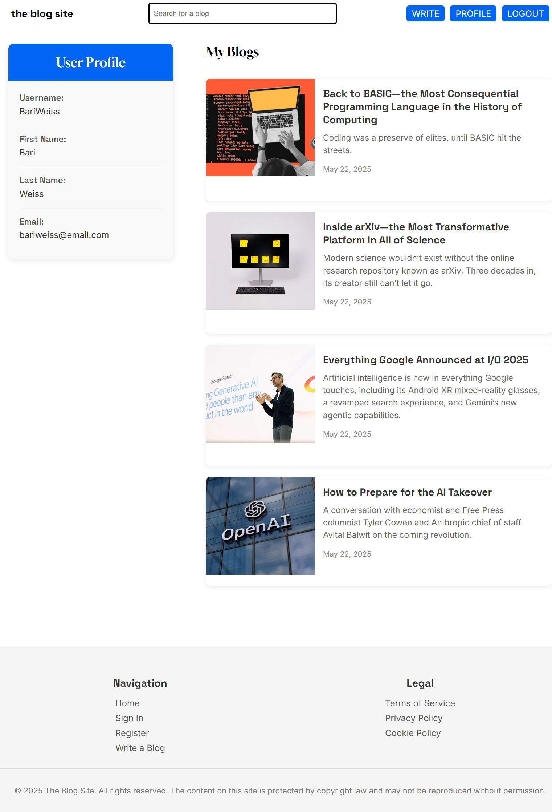

# the blog site

A modern, full-stack blogging platform built with Node.js, Express, MySQL, and Handlebars. This project demonstrates a clean, responsive UI, user authentication, dynamic blog content, and RESTful API integration.

## Features

- **User Authentication:** Secure registration and login with hashed passwords.
- **Blog Creation:** Authenticated users can write, edit, and publish blogs with images.
- **Dynamic Content:** Blogs, comments, and user profiles are rendered dynamically from a MySQL database.
- **Comment System:** Logged-in users can comment on blog posts.
- **Search Functionality:** Full-text search across blog titles, descriptions, and content.
- **Responsive Design:** Mobile-friendly UI using modern CSS and Google Fonts.
- **Profile Pages:** Each user has a profile page listing their blogs.
- **SEO-Friendly URLs:** Blog posts are accessible via clean, slug-based URLs.
- **RESTful API:** Endpoints for blogs, comments, and search.

## Tech Stack

- **Backend:** Node.js, Express.js, MySQL, bcrypt, multer
- **Frontend:** HTML5, CSS3, JavaScript (ES6+), Handlebars (hbs)
- **Templating:** Handlebars for server-side rendering
- **Authentication:** Custom session management (localStorage on client, bcrypt for passwords)
- **File Uploads:** Multer for handling blog images

## Project Structure

```
/public         # Static assets (HTML, CSS, JS, images)
/views          # Handlebars templates and partials
/server         # Express server and backend logic
```

## Getting Started

1. **Clone the repository:**
   ```
   git clone https://github.com/rayyan005/blog-site.git
   cd blog-site
   ```

2. **Install dependencies:**
   ```
   npm install
   ```

3. **Configure environment variables:**
   - Copy `.env.example` to `.env` and fill in your MySQL credentials.

4. **Set up the database:**
   - Create a MySQL database and run the provided schema to create tables for users, blogs, and comments.

5. **Run the server:**
   ```
   node server/server.js
   ```
   The app will be available at [http://localhost:3000](http://localhost:3000).

## Screenshots

> 
> 
> 
> 
> 
> 

## License

This project is for demonstration and educational purposes.

---

*Built by Rayyan. For questions or collaboration, please contact via [GitHub](https://github.com/rayyan005).*
